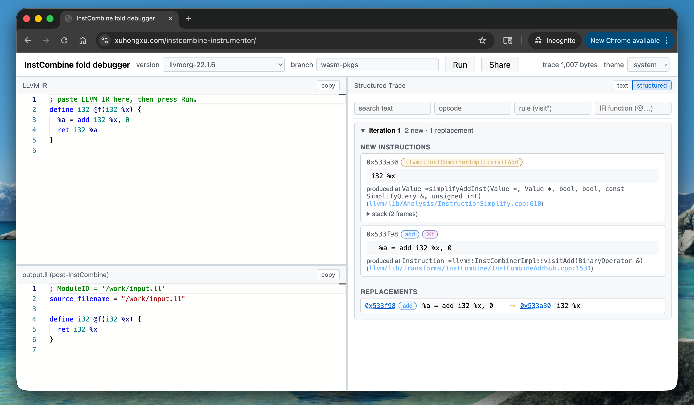

# instcombine-instrumentor

**Try it:** <https://xuhongxu.com/instcombine-instrumentor/>



Build an instrumented LLVM `opt` that records every new instruction and every
RAUW replacement performed by InstCombine / InstructionSimplify on each pass
iteration.

Ships in two flavors:

- **Native `opt`**<br>
  patched LLVM build, traces to `llvm_fuzz_info.txt`
  (human-readable) plus `llvm_fuzz_info.json` (JSON Lines sidecar).
- **In-browser webapp**<br>
  Vite + React + Monaco SPA running a minimal
  WebAssembly InstCombine on user-pasted IR. <br>

> The trace file names include "fuzz" because the original motivation was to use this as a method of generating coverage-guided fuzzing traces for LLVM IR transformations, but the tool is general-purpose and can be used for manual inspection as well.

## Quickstart (native `opt`)

Deps managed by [uv](https://github.com/astral-sh/uv).

```bash
uv sync
bash clone_llvm.sh
uv run python patch_llvm.py --llvm-repo thirdparty/llvm-project
bash build_patched_llvm.sh
bash smoke_test.sh     # builds a tiny IR through opt and checks the trace
```

The patched binary writes `./llvm_fuzz_info.txt` (text) and
`./llvm_fuzz_info.json` (JSONL sidecar) into the current working directory.

Set `DISABLE_INSTCOMBINE_TRACE=1` at runtime to suppress instrumentation
entirely.

## Quickstart (webapp / WebAssembly)

Prereqs: native toolchain (clang/lld/cmake/ninja), activated
[emsdk](https://emscripten.org/) `5.0.7`, Node 20+.

```bash
git clone --depth 1 https://github.com/emscripten-core/emsdk.git thirdparty/emsdk
./thirdparty/emsdk/emsdk install 5.0.7 && ./thirdparty/emsdk/emsdk activate 5.0.7
source ./thirdparty/emsdk/emsdk_env.sh

bash clone_llvm.sh
uv run python patch_llvm.py --llvm-repo thirdparty/llvm-project
bash build_wasm.sh                # ~10-30 min cold; rebuilds host tblgen incrementally
node wasm/test/smoke_wasm.mjs     # smoke

cd web && npm install && npm run dev
# → http://localhost:5173/instcombine-instrumentor/
```

## Bumping the LLVM version

Edit `llvm_commit.txt`, then re-run the patcher and whichever build you care
about.

```bash
bash clone_llvm.sh
uv run python patch_llvm.py --llvm-repo thirdparty/llvm-project
bash build_patched_llvm.sh    # native opt
bash build_wasm.sh            # webapp wasm (requires emsdk)
```

To edit the injected runtime, edit `runtime/fuzz_runtime.{h,cpp}` directly;
the patcher reads them at import time.

## How the webapp picks a wasm build

Wasm artifacts for many LLVM versions live on the orphan `wasm-pkgs` branch
of this repo, one directory per ref (`llvmorg-X.Y.Z[-rcN]/` for stable tags,
`main-<YYMMDD>-<sha12>/` for every-three-day LLVM-main snapshots). The webapp fetches
`manifest.json` from the branch via `raw.githubusercontent.com` at startup,
so new builds appear in the version picker without redeploying Pages.

Publishing is driven by `.github/workflows/wasm-publish.yml`:

- Monday 05 UTC — scan upstream LLVM for missing stable `llvmorg-X.Y.Z` tags
  and build the newest few.
- Daily 06 UTC — build current LLVM main HEAD; the workflow keeps the last 7
  snapshots and prunes older ones.
- `workflow_dispatch` — manual build of any tag or commit SHA.

CI / native releases are split into independent paths: native `opt-llvm-*.tar.xz`
tarballs still attach to GitHub Releases via `release/<llvm-tag>` (created by
`native-release-auto.yml` / `native-release-manual.yml`); the wasm flow is
entirely separate.

### Custom builds

Use `.github/workflows/wasm-custom-publish.yml` to build a custom ref in a fork of llvm and publish it to the custom branch.

The webapp supports specifying a custom branch
to load the manifest.

## More

See [`CLAUDE.md`](CLAUDE.md) for the patching/runtime architecture, trace
format, full CI layout (per-workflow scripts under `.github/scripts/`), and
the env-var reference.

## License

Apache License 2.0 with LLVM Exceptions, matching upstream LLVM. See
[`LICENSE`](LICENSE).
